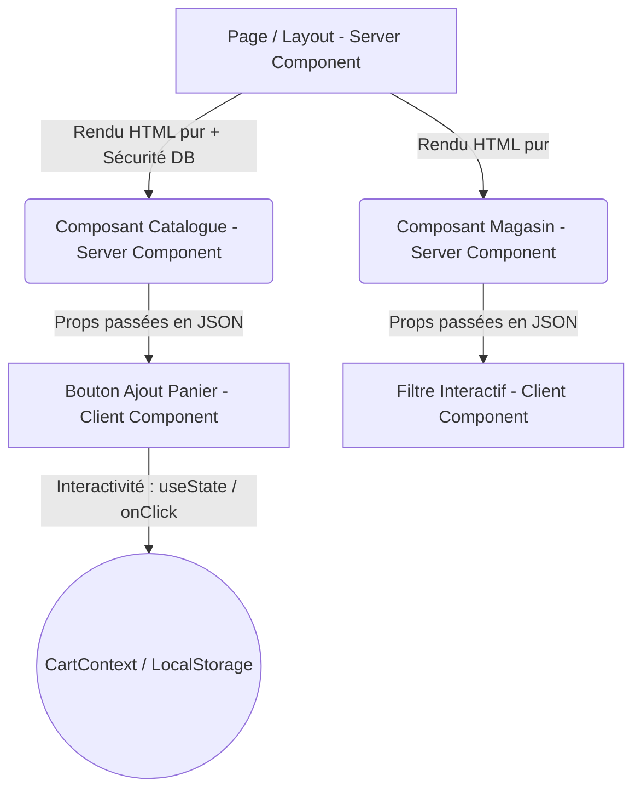
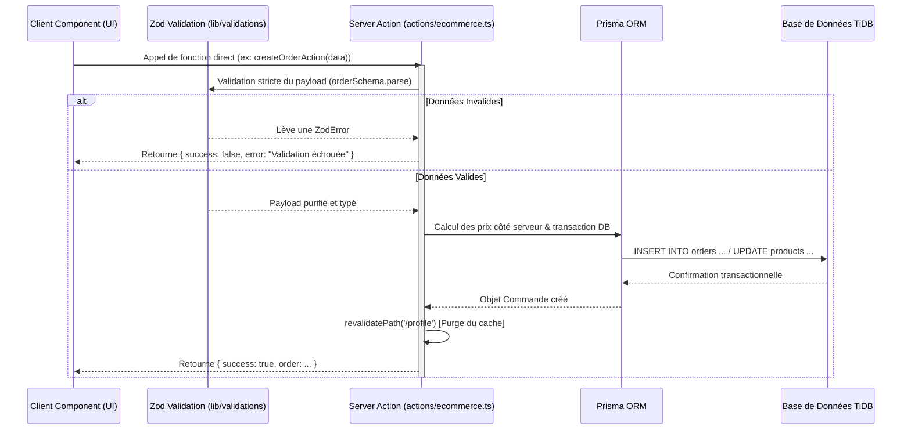
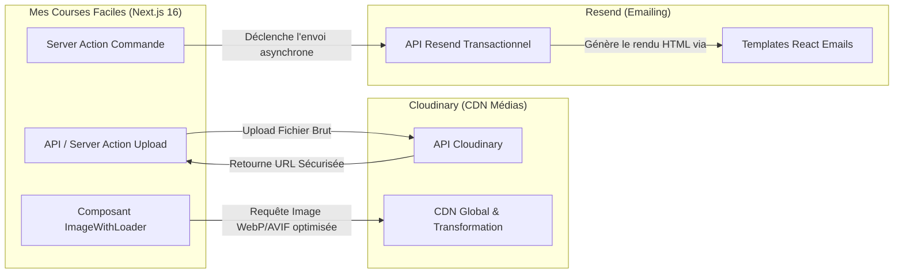

# Document Technique Explicatif & Architecture Générale
**Projet :** Mes Courses Faciles (Plateforme E-Commerce Moderne)  
**Destinataires :** Soutenance Académique, Architecture Review & Transfert de Compétences Technique  

---

## 📋 Synthèse Exécutive & Présentation du Projet

**Mes Courses Faciles** est une application web e-commerce moderne, performante et hautement disponible, conçue pour connecter les consommateurs aux commerçants locaux. Elle intègre un catalogue dynamique de produits, un système multi-magasins, un tunnel de commande sécurisé et un espace d'administration complet pour la gestion opérationnelle.

L'application repose sur un écosystème technologique de pointe axé sur la performance, le typage strict (Type-Safety) et l'expérience utilisateur (UX) :
*   **Framework Core :** [Next.js 16](https://nextjs.org/) (App Router) avec un rendu hybride (Serveur / Client).
*   **Langage :** [TypeScript](https://www.typescriptlang.org/) (typage de bout en bout).
*   **Base de Données & ORM :** [TiDB](https://www.pingcap.com/) (base de données relationnelle MySQL cloud-native et scalable) pilotée par [Prisma ORM](https://www.prisma.io/).
*   **Interface Utilisateur (UI/UX) :** [Tailwind CSS](https://tailwindcss.com/) pour le stylage atomique, couplé à [Shadcn UI](https://ui.shadcn.com/) / [Radix UI](https://www.radix-ui.com/) pour des composants accessibles et modernes.
*   **Services Tiers :** [Cloudinary](https://cloudinary.com/) pour la gestion et l'optimisation des médias, et [Resend](https://resend.com/) pour l'orchestration des emails transactionnels.

---

## 1. Vue d'Ensemble de l'Architecture (Le Paradigme Next.js)

### A. Le Fonctionnement du Next.js App Router
L'application utilise l'**App Router** de Next.js, un paradigme moderne qui redéfinit la relation entre le client et le serveur. Contrairement aux applications monopages (SPA) traditionnelles où le navigateur télécharge un bundle JavaScript massif et exécute les requêtes API pour construire l'interface, l'App Router s'appuie sur l'architecture des **React Server Components (RSC)**.

Le serveur participe activement à la composition de l'interface : le routage est géré côté serveur, et chaque navigation envoie au navigateur un flux HTML et JSON pré-rendu (le *RSC Payload*), minimisant ainsi le travail du processeur client et accélérant drastiquement le temps d'affichage initial (First Contentful Paint - FCP).

### B. Cohabitation : Server Components vs Client Components
L'architecture de *Mes Courses Faciles* respecte une séparation stricte entre deux types de composants :



1. **Les Server Components (Par Défaut) :**
   *   **Le Pourquoi :** Maximiser les performances SEO, réduire le volume du JavaScript expédié au navigateur et sécuriser la logique métier. Les Server Components ont un accès direct et sécurisé à l'infrastructure backend (base de données TiDB, clés API privées).
   *   **Le Comment :** Tout fichier dans `src/app/` ou `src/components/` qui ne déclare pas explicitement une directive de script client est un Server Component. Par exemple, les pages de catalogue (`src/app/(main)/page.tsx`) ou de détail magasin (`src/app/(main)/store/[id]/page.tsx`) interrogent directement Prisma en asynchrone (`async/await`), sans nécessiter de hook `useEffect` ni d'état de chargement manuel.
2. **Les Client Components (L'Interactivité) :**
   *   **Le Pourquoi :** Gérer l'interactivité en temps réel : écouter les clics, manipuler le DOM, animer l'interface et accéder aux API natives du navigateur (`window`, `localStorage`, hooks React comme `useState`, `useEffect`, `useCallback`).
   *   **Le Comment :** Ils sont identifiés par la directive `"use client";` placée en première ligne du fichier. Exemples clés dans notre codebase : le tiroir du panier (`src/components/blocks/cart/CartDrawer.tsx`), le gestionnaire de panier (`src/context/CartContext.tsx`) ou les tableaux d'administration dynamiques (`src/components/blocks/admin/AdminOrdersClient.tsx`).
3. **Stratégie de Cohabitation (The Leaf Architecture) :**
   *   Nous appliquons le principe des "feuilles de l'arbre". L'arborescence générale, les layouts et les conteneurs de données restent des Server Components. Seuls les éléments interactifs finaux (les boutons d'action, les menus déroulants, les formulaires) sont isolés dans des Client Components, recevant leurs données du serveur sous forme de *props* en lecture seule.

---

## 2. Arborescence et Organisation du Code

L'application est structurée selon le principe de **séparation des responsabilités** (*Separation of Concerns*), garantissant une maintenabilité et une lisibilité optimales :

```
mes-courses-faciles-app/
├── prisma/
│   └── schema.prisma         # Modélisation relationnelle de la base de données TiDB
├── src/
│   ├── actions/              # Server Actions (Mutations côté serveur et logique métier)
│   ├── app/                  # Routage par dossiers (App Router) et Layouts
│   ├── components/           # Bibliothèque de composants graphiques (Atomique & Métier)
│   ├── context/              # Fournisseurs d'état global côté client (React Context)
│   └── lib/                  # Singletons, services utilitaires et schémas de validation
```

### A. Rôle Précis des Dossiers Clés
*   `src/app/` : Cœur du système de routage. Il est divisé en **groupes de routes** (dossiers entre parenthèses) qui partagent des mises en page spécifiques sans influencer l'URL :
    *   `(main)/` : Interface publique et navigation commerciale (Accueil, Catalogue, Profil).
    *   `(checkout)/` : Tunnel de commande isolé, disposant d'un layout épuré sans navigation superflue pour maximiser le taux de conversion.
    *   `(dashboard)/admin/` : Espace de gestion administrative sécurisé par contrôle de rôle (RBAC).
*   `src/actions/` : Contient les **Server Actions** (`auth.ts`, `ecommerce.ts`, `admin.ts`). Ce sont les points d'entrée des mutations de données (création de commande, mise à jour de stock, authentification).
*   `src/components/` : Structuré en quatre strates logiques :
    *   `ui/` : Primitives graphiques réutilisables et sans logique métier (boutons, modales, champs de sélection), générées via Shadcn UI (`button.tsx`, `select.tsx`, `dialog.tsx`).
    *   `blocks/` : Assemblages métiers complexes organisés par domaine (`admin/`, `cart/`, `catalog/`, `client/`, `home/`, `search/`, `stores/`).
    *   `common/` : Composants transversaux partagés (`PageLayout.tsx`, `DataTable.tsx`, `Skeletons.tsx`).
    *   `layout/` : Éléments de navigation structurels (`public/Navbar.tsx`, `BottomTabBar.tsx`).
*   `src/context/` : Héberge les contextes React clients pour le partage d'état en mémoire (`CartContext.tsx`, `AuthContext.tsx`, `ToastContext.tsx`).
*   `src/lib/` : Utilitaires et configurations globales : pool de connexion base de données (`prisma.ts`), règles de sécurité et gardiens de routes (`auth-guard.ts`), résolution des médias (`image-resolver.ts`), envoi d'emails (`mail.ts`), et schémas de validation stricts (`validations/schemas.ts`).

### B. Le Système de Routage par Dossiers et Fichiers Spéciaux
Dans l'App Router, chaque dossier représente un segment de l'URL, et des fichiers aux noms réservés en définissent le comportement :
*   `page.tsx` : Rends la route publiquement accessible. C'est le composant qui affiche l'interface principale du segment (ex: `/store/[id]/page.tsx` correspond à l'URL `/store/123`).
*   `layout.tsx` : Définit une interface partagée entre plusieurs pages enfants (en-tête, menu latéral, fournisseurs de contexte). **Point crucial :** lors d'une navigation entre pages sœurs, le layout ne se re-rend pas ; il préserve son état en mémoire, offrant une navigation instantanée et fluide.
*   `loading.tsx` : Exécute nativement `React.Suspense`. Il affiche automatiquement une interface d'attente (squelette visuel) dès le début de la requête réseau, masquant la latence du serveur.
*   `route.ts` : Crée un endpoint API REST traditionnel (ex: `src/app/api/upload/route.ts`). Il est utilisé pour les intégrations nécessitant des webhooks externes, des réceptions de fichiers ou des communications HTTP brutes.

---

## 3. Gestion des Données et de l'État (Le Flux)

### A. Backend & Base de Données : Prisma et TiDB
Le stockage persistant s'appuie sur **TiDB**, une base de données relationnelle distribuée et scalable, couplée à **Prisma ORM**.
*   **Le Fichier de Vérité : `schema.prisma` :** Il modélise précisément le domaine. On y retrouve les entités (`User`, `Store`, `Product`, `Order`, `OrderItem`), les types énumérés (`Role`, `OrderStatus`) et l'intégrité référentielle (relations 1-à-N et N-à-N).
*   **Type-Safety de Bout en Bout :** Prisma génère automatiquement des types TypeScript à partir du schéma. Toute tentative de requête avec un champ inexistant ou un type incorrect est bloquée dès la phase de compilation.
*   **Gestion du Pool :** Le singleton `src/lib/prisma.ts` évite la saturation des connexions en environnement Serverless/Edge en instanciant un client Prisma unique partagé à travers l'application.

### B. Les Mutations : Le Paradigme des Server Actions
Contrairement aux architectures web traditionnelles qui nécessitent la création manuelle d'une API REST (avec contrôleurs, routage HTTP et sérialisation/désérialisation manuelle), *Mes Courses Faciles* exploite les **Server Actions** (comme dans `src/actions/ecommerce.ts`).



1. **Sécurité & Intégrité :** Lorsqu'un client valide son panier, le Client Component appelle directement la Server Action `createOrderAction`. Cette fonction (marquée par `"use server";`) s'exécute exclusivement sur le serveur.
2. **Validation Zod :** Avant de toucher à la base de données, la Server Action fait passer les données brutes dans le filtre Zod (`src/lib/validations/schemas.ts`).
3. **Logique Métier Anti-Fraude :** Pour éviter qu'un utilisateur malveillant ne modifie les prix dans son navigateur avant l'envoi, la Server Action ne fait pas confiance au montant total envoyé par le client : elle interroge Prisma pour récupérer le prix officiel de chaque produit en base de données, recalcule le total côté serveur, applique la transaction, puis invalide le cache de routage (`revalidatePath`) pour mettre à jour instantanément les écrans.

### C. État Client : CartContext et Stabilité Mémoire (Mémoïsation)
Pour la gestion du panier, l'application utilise l'API Context de React (`src/context/CartContext.tsx`), garantissant une UI réactive à travers toute la plateforme sans requêtes serveur répétitives.

*   **Synchronisation Persistante :** Un hook `useEffect` écoute les modifications du panier et sérialise continuellement l'état dans le `localStorage` du navigateur. À la réouverture de l'application, le panier est restauré instantanément.
*   **L'Importance Technique Critique de `useCallback` :**
    En React, lorsqu'un composant ou un fournisseur de contexte se re-rend, toutes les fonctions déclarées à l'intérieur (ex: `addToCart`, `removeFromCart`, `clearCart`, `updateQuantity`) sont recréées avec une nouvelle adresse en mémoire. 
    
    Si une fonction non mémoïsée est utilisée dans le tableau de dépendances d'un hook `useEffect` d'un composant enfant (par exemple, appeler `clearCart()` sur la page de confirmation de commande `/checkout/success`), la modification de la référence mémoire provoque le ré-affichage du composant, ce qui redéclenche le `useEffect`, créant une **boucle infinie de rendus** (*Maximum update depth exceeded*).
    
    Pour garantir la stabilité de l'application, chaque fonction de modification d'état dans `CartContext.tsx` est rigoureusement enveloppée dans le hook `useCallback`. Cette technique de **mémoïsation** fige la référence mémoire de la fonction tant que ses dépendances internes n'ont pas changé, éliminant définitivement les re-rendus superflus et les boucles de crash.

---

## 4. Intégration des Services Tiers

L'architecture intègre des services cloud spécialisés pour décharger le serveur principal des tâches lourdes :



### A. Cloudinary : Gestion et Optimisation des Médias
*   **Le Pourquoi :** Le stockage et le traitement d'images haute résolution (logos de commerces, photos de produits) sur un serveur web standard consomment excessivement de la bande passante et dégradent les performances de chargement.
*   **Le Comment :** Cloudinary agit comme un CDN et un moteur de transformation d'assets en temps réel. Lors de l'upload, l'image est sécurisée dans le cloud. Lors de l'affichage, notre utilitaire `src/lib/image-resolver.ts` et le composant `ImageWithLoader.tsx` construisent des URL dynamiques qui redimensionnent l'image à la taille exacte de l'écran et la convertissent aux formats de compression modernes (WebP ou AVIF). De plus, le système intègre des fallbacks automatiques en cas d'absence d'image, empêchant tout affichage brisé.

### B. Resend : Notifications Transactionnelles
*   **Le Pourquoi :** Une plateforme e-commerce exige une communication fiable et instantanée (reçus de commande, confirmations de compte) avec une délivrabilité maximale (anti-spam).
*   **Le Comment :** Piloté via `src/lib/mail.ts`, Resend est couplé à des templates React rédigés en JSX (ex: `src/emails/OrderReceiptEmail.tsx`). Lors de la validation d'une commande dans la Server Action, l'envoi de l'email est déclenché de manière asynchrone, garantissant que la confirmation visuelle à l'utilisateur n'est jamais retardée par le temps de réponse du serveur de messagerie.

---

## 5. UI, UX et Composants

L'excellence visuelle et interactive de l'application repose sur une conception orientée utilisateur et une accessibilité rigoureuse.

### A. Approche Modulaire : Tailwind CSS et Shadcn UI
*   **Stylage Atomique avec Tailwind CSS :** L'utilisation de classes utilitaires directement dans le JSX permet un prototypage rapide, un design absolument cohérent (système de design basé sur des tokens de couleurs, d'espacements et d'ombres) et un fichier CSS en production d'une légèreté exceptionnelle (uniquement le code utilisé est compilé).
*   **Composants Accessibles via Shadcn UI / Radix UI :** Plutôt que de réinventer des composants complexes (comme les boîtes de dialogue, les menus déroulants `Select`, les tiroirs `Drawer` ou les tableaux de données), nous utilisons des primitives sans style de Radix UI, habillées par Shadcn UI. Cela garantit une accessibilité WAI-ARIA parfaite : navigation intégrale au clavier, focus trap dans les modales et compatibilité avec les lecteurs d'écran.

### B. Résilience, Squelettes de Chargement et Tolérance aux Pannes
Une application professionnelle se doit de rester élégante même lors des phases d'attente ou en cas d'erreur réseau :

1. **États de Chargement et `Suspense` (Skeletons) :**
   Grâce aux fichiers `loading.tsx` et à l'utilisation stratégique des frontières `<Suspense>` de React, l'utilisateur ne fait jamais face à des sauts de mise en page (CLS - *Cumulative Layout Shift*) ou à un écran gelé. Pendant que le serveur interroge la base de données, des squelettes visuels animés (`src/components/common/Skeletons.tsx`) reflètent la structure exacte du contenu à venir (cartes produits, tableaux de commandes).
2. **Gestion des Erreurs et Feedback Utilisateur (Toasts & Error Boundaries) :**
   *   **Feedback Instantané :** Le contexte `ToastContext.tsx` permet d'émettre des notifications flottantes non intrusives pour confirmer chaque action clé (ex: *"Produit ajouté au panier avec succès"* ou *"Erreur lors de la mise à jour du statut"*).
   *   **Isolation des Erreurs :** Des frontières d'erreurs (*Error Boundaries* et fichiers `error.tsx`) encadrent chaque route critique. Si un composant échoue (panne réseau temporaire, donnée corrompue), seule la zone concernée affiche un message de secours avec un bouton de réessai, laissant le reste de l'application (navigation, panier, en-tête) parfaitement fonctionnel et accessible.

---

## 🎯 Conclusion

L'architecture de **Mes Courses Faciles** représente l'état de l'art du développement web moderne. En combinant la puissance du rendu serveur **Next.js App Router**, la sécurité du typage **TypeScript/Zod**, la scalabilité de **TiDB/Prisma**, et l'optimisation millimétrée de l'état client (**Zustand/Context avec mémoïsation**), l'application offre une plateforme e-commerce rapide, robuste, maintenable et prête pour un déploiement à grande échelle.
